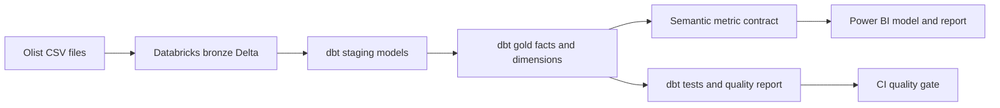

# Olist Analytics Platform


An end-to-end, SQL-first analytics platform built on the public Olist Brazilian e-commerce dataset.

This project is designed as a portfolio-quality proof of work for data platform, analytics engineering, and developer advocacy roles. It demonstrates how I approach an ambiguous data problem: establish clear grains, build reusable governed models, define a semantic contract for metrics, test the trust layer, and make the result easy for another person to run and understand.

## Why this project is relevant

The repository reflects the work I have done in enterprise data environments:

- reusable staging and dimensional models rather than one-off analysis;
- order-, item-, customer-, product-, seller-, and geography-level grains;
- data-quality checks for uniqueness, relationships, completeness, accepted values, and financial reconciliation;
- a semantic metric catalog with explicit definitions and owners of meaning;
- an interactive dashboard for business and technical audiences;
- documentation that turns implementation choices into teachable examples.

The production-style modeling layer is dbt, with Databricks/Delta as the intended lakehouse target and Power BI as the consumption layer. A small SQLite preview adapter is included so the project is easy to validate without cloud credentials.

## Architecture



## Repository map

```text
app/dashboard.py                 Local metric preview dashboard
data/raw/README.md               Dataset setup and attribution
dbt_project.yml                  Production-style dbt project config
databricks/olist_medallion.sql   Databricks bronze/silver/gold extension
docs/architecture.md             Data flow and design decisions
docs/semantic-model.md           Grains, dimensions, and metrics
docs/portfolio-story.md          Interview and README talking points
models/staging/                  Source-aligned cleaning views
models/marts/                    Dimensional facts and dimensions
models/semantic/                 Metric-ready semantic views
powerbi/measures.dax              Power BI measure definitions
powerbi/model-definition.md       Power BI relationships and UX notes
scripts/run_pipeline.py          Build the local warehouse
scripts/generate_dashboard_preview.py  Create a static HTML preview
src/olist_analytics/             Pipeline, validation, metrics, and reporting code
tests/                            Standard-library tests for model logic
```

## Quick start

The repository does not commit the Kaggle CSVs. Download them from the source listed in [`data/raw/README.md`](data/raw/README.md), or use the files supplied for this project.

```bash
cd olist-analytics-platform
python -m venv .venv
source .venv/bin/activate
pip install -r requirements.txt

# Local preview: point the pipeline at the folder containing the nine Olist CSV files.
python scripts/run_pipeline.py --raw-dir /path/to/olist_csvs

# Generate a self-contained HTML dashboard preview.
python scripts/generate_dashboard_preview.py

# Optional: run the interactive app.
streamlit run app/dashboard.py

# Run tests that do not require the full dataset.
python -m unittest discover -s tests -v
```

The default warehouse path is `data/warehouse/olist.sqlite`. Override it with `OLIST_DB_PATH`.

## Dashboard

The dashboard is organized around four questions:

1. How is commerce performance changing over time?
2. Which categories and states contribute to merchandise revenue?
3. Where does delivery performance create customer risk?
4. How are reviews and payment behavior distributed?

The app uses the semantic views instead of rebuilding metric logic in chart code. That separation is deliberate: a metric should have one definition even when it appears in multiple charts, notebooks, or enablement examples.

## Semantic layer

The metric catalog lives in [`models/semantic/metrics.yml`](models/semantic/metrics.yml). Core measures include:

- `merchandise_revenue`: sum of item prices, excluding freight;
- `freight_revenue`: sum of freight values;
- `orders`: distinct order count;
- `customers`: distinct customer count at `customer_unique_id` grain;
- `average_order_value`: merchandise revenue divided by orders;
- `on_time_delivery_rate`: delivered orders delivered on or before the estimated delivery date;
- `average_review_score`: average review score for orders with a review.

The project separates order-grain measures from item-grain measures to prevent the common double-counting error where order-level revenue or review values are repeated once per item.

## Data quality

The pipeline writes a machine-readable report to `reports/quality_report.json`. Checks include:

- unique primary keys for orders, order items, products, customers, sellers, and reviews;
- relationships from order items to orders/products/sellers;
- accepted order statuses and review scores;
- non-negative price and freight values;
- timestamp ordering for approval, carrier hand-off, delivery, and estimated delivery, with source anomalies surfaced as warnings;
- reconciliation of item-level merchandise revenue to the order-level fact.

## dbt, Databricks, and Power BI path

The dbt project is the production-style source of truth for the transformations. A Databricks deployment would preserve the same contracts while replacing only the local source and target configuration:

1. land the Olist files in a Databricks volume or cloud object storage;
2. create bronze Delta tables with ingestion metadata;
3. run the dbt staging, mart, and semantic models against Databricks SQL;
4. expose the gold star schema and semantic measures to Power BI;
5. add Delta expectations, Unity Catalog governance, row-level security, and refresh monitoring.

The same semantic contracts can also be adapted to Snowflake if the target role requires it. The repository demonstrates the transferable modeling and enablement work without pretending that a local Kaggle project is already a production cloud deployment.

## Source and attribution

Source: [Brazilian E-Commerce Public Dataset by Olist on Kaggle](https://www.kaggle.com/datasets/olistbr/brazilian-ecommerce). The dataset contains approximately 100,000 orders with customer, product, seller, payment, review, and geolocation information covering 2016–2018.

The code in this repository is intended as portfolio work. Review the dataset's current Kaggle terms before redistributing the raw files or publishing derived assets.

## Suggested portfolio demo

Start with the dashboard, then open the semantic model and one quality check. In five minutes, explain:

1. the business question;
2. the grain of the dataset used to answer it;
3. the metric definition;
4. the data-quality rule that protects it;
5. how the same model could move to Snowflake.
